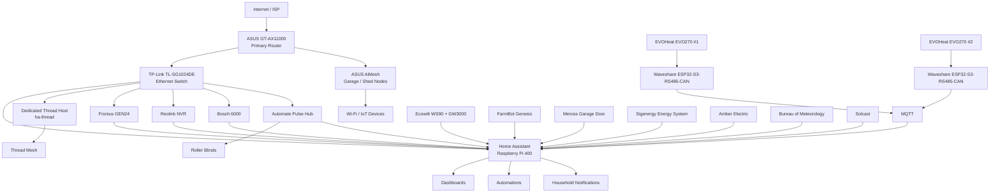

# Whole-Home Architecture

This document describes the logical architecture of the Home Assistant installation and the main infrastructure that supports it.

The objective is to document **how the systems communicate**, not merely list devices. Detailed device/entity mappings will live in `inventory/` and within each subsystem under `systems/`.

## Architectural principles

The installation is progressively being documented around these principles:

1. **Local control where practical** — critical household systems should not depend unnecessarily on vendor cloud services.
2. **Home Assistant as the orchestration layer** — dashboards, automations, notifications and cross-system logic are centralized in HA.
3. **MQTT for suitable local devices** — particularly ESP32-based projects such as the EVOHeat integration.
4. **Dedicated infrastructure for Thread** — Thread/OTBR functionality is separated from the primary HA host.
5. **Public-safe configuration** — this repository contains reproducible configuration without credentials or unnecessary private identifiers.
6. **Subsystem isolation** — substantial projects can retain their own standalone repositories while the master HA repository documents how they fit into the house.

## Logical system overview



> The diagram is intentionally logical rather than a full physical wiring diagram. Exact port assignments, addresses and identifiers will only be published where they materially improve reproducibility.

## Core Home Assistant host

The primary Home Assistant system runs on a **Raspberry Pi 400**.

The host has used both Ethernet and Wi-Fi connectivity. The repository will ultimately document the preferred production connection, recovery path and rebuild process without exposing credentials.

Primary responsibilities include:

- Home Assistant Core and integrations;
- dashboards;
- automations and scripts;
- notifications;
- cross-system logic;
- energy/solar monitoring and control;
- weather aggregation;
- garden/FarmBot integration;
- waste collection reminders;
- garage, security and blind integrations;
- MQTT consumption for local projects.

## Dedicated Thread infrastructure

A separate Raspberry Pi currently uses hostname **`ha-thread`** and provides dedicated Thread infrastructure.

Known characteristics:

- Ethernet-connected Linux host;
- Thread `wpan0` interface;
- Docker networking present;
- dedicated role separate from the primary HA Pi 400.

The complete OTBR/Thread commissioning procedure, radio hardware and dataset handling still require a live-system documentation pass.

## Local ESP32 / RS485 architecture

The two EVOHeat EVO270 hot-water systems use a local architecture:

```text
EVO270 controller
    ↓ RS485 / Modbus RTU
Waveshare ESP32-S3-RS485-CAN
    ↓ Wi-Fi / MQTT
Home Assistant
```

This replaces dependence on the original hot-water cloud/Wi-Fi path for the documented local monitoring implementation.

Detailed firmware, wiring, Modbus findings and Home Assistant dashboard work remain in the dedicated repository:

https://github.com/Darksplat/EVOHeat-EVO270-ESP32-Modbus

## Energy architecture

The energy system currently includes:

- Fronius Symo GEN24 10.0 kW three-phase inverter;
- Sigenergy inverter/battery platform;
- Amber Electric dynamic pricing/curtailment;
- Solcast forecasting;
- Home Assistant energy/solar entities and dashboards.

Home Assistant testing has demonstrated local control of the Fronius AC power limit. The exact relationship between Amber curtailment, Sigenergy response and Fronius control is being documented under `systems/solar-energy/`.

## Weather architecture

Weather information is derived from both local and external sources:

- **Ecowitt WS90 + GW3000** for local measurements;
- **Bureau of Meteorology** for forecast/weather-service data.

Home Assistant combines these sources for dashboards and other automations. Responsive dashboard variants for desktop, tablet and mobile are part of the migration scope.

## Garden / FarmBot architecture

FarmBot Genesis is integrated with Home Assistant and shares environmental/weather information with the garden dashboards and automations.

The existing standalone project remains available at:

https://github.com/Darksplat/Homeassistant-Farmbot

The master repository will document the HA-facing configuration and cross-system dependencies without unnecessarily duplicating the standalone project.

## Notifications and household workflows

Home Assistant Companion App notification targets are used for individual mobile devices, with a household notification group for common alerts.

Current examples include:

- bin-night reminders;
- system alerts;
- household task/NFC workflows.

Public examples will use generic household names and placeholder NFC/tag identifiers.

## Documentation state

This architecture is the **initial baseline reconstructed from the known working installation and recent troubleshooting**. It must be verified subsystem-by-subsystem against the live Home Assistant configuration as files are migrated into this repository.
