# Whole-Home Architecture

This document describes the logical architecture of the working Home Assistant installation using the generated 9 September 2026 live snapshot as evidence.

The public repository documents system roles, protocols and dependencies while deliberately omitting credentials, stable hardware identifiers, raw device/entity registries and household-specific private data.

## Live baseline

The source Home Assistant snapshot reported:

- 26 areas
- 163 registry devices before privacy filtering
- 2,688 registry entities before privacy filtering
- 54 integration entries across 41 domains
- 12 storage-mode dashboards before privacy filtering
- 12 custom components
- 3 ESPHome YAML files present on the live host

After public privacy filtering, 11 dashboard exports remain; the household-specific dashboard is intentionally excluded.

## Logical architecture

```mermaid
flowchart TD
    HA[Home Assistant Core / Supervisor / OS]

    subgraph Local Infrastructure
        MQTT[Mosquitto / MQTT]
        MATTER[Matter Server]
        OTBR[OpenThread Border Router]
        ESP[ESP / DIY Devices]
    end

    subgraph Energy
        FRONIUS[Fronius GEN24 + Smart Meter]
        SIGEN[Sigenergy ESS]
        AMBER[Amber Electric]
        SOLCAST[Solcast]
    end

    subgraph Weather
        ECOWITT[Ecowitt]
        BOM[Bureau of Meteorology]
        MET[Met.no]
    end

    subgraph Garden
        FARMBOT[FarmBot]
        RAINBIRD[Rain Bird]
        MEROSS[Meross LAN]
    end

    subgraph Home Systems
        EVO[EVOHeat EVO270 x2]
        BLINDS[Automate Pulse Pro / Matter Shades]
        REOLINK[Reolink NVR / Cameras / Doorbell]
        GARAGE[Meross Garage Door]
        LETTERBOX[Letterbox Sentinel]
        ROBOROCK[Roborock]
        MEDIA[LG webOS / Yamaha MusicCast / Cast]
    end

    MQTT --> HA
    MATTER --> HA
    OTBR --> MATTER
    ESP --> MQTT

    FRONIUS --> HA
    SIGEN --> HA
    AMBER --> HA
    SOLCAST --> HA

    ECOWITT --> HA
    BOM --> HA
    MET --> HA

    FARMBOT --> HA
    RAINBIRD --> HA
    MEROSS --> HA

    EVO --> MQTT
    BLINDS --> HA
    REOLINK --> HA
    GARAGE --> HA
    LETTERBOX --> MQTT
    ROBOROCK --> HA
    MEDIA --> HA

    HA --> DASH[Dashboards]
    HA --> AUTO[Automations / Scripts]
    HA --> NOTIFY[Notifications]
```

This is a logical dependency diagram, not a physical wiring or switch-port map.

## Home Assistant as orchestration layer

Home Assistant provides the common control plane for the installation:

- dashboards and frontend presentation
- automations and scripts
- cross-system logic
- notifications
- energy and tariff logic
- weather aggregation
- device state and fault visibility
- local MQTT consumption
- Matter and Thread device control

The live integration inventory confirms `mqtt`, `matter`, `thread`, `otbr`, `hassio`, `raspberry_pi`, `rpi_power`, `mobile_app`, HACS and a large set of subsystem integrations.

## MQTT and DIY/local integrations

MQTT is a major local integration path. The live system includes the MQTT integration and Mosquitto broker app.

Current public examples include:

- two EVOHeat EVO270 hot-water systems
- Letterbox Sentinel
- other DIY/local entities consumed by dashboards and automations

The specialised EVOHeat firmware, RS485/Modbus work and commissioning detail remain in:

`Darksplat/EVOHeat-EVO270-ESP32-Modbus`

## Thread and Matter

The live installation contains all three relevant integration layers:

- `thread`
- `otbr`
- `matter`

and the corresponding Matter Server / OpenThread Border Router apps.

The public system inventory confirms Matter-connected devices including shades and IKEA devices. Thread dataset material is explicitly excluded from the repository.

## Energy architecture

The live energy stack contains:

- Fronius integration
- Sigenergy ESS custom integration
- Amber Express
- Solcast PV Forecast
- Electricity/carbon data

The exported automation `Fronius - Amber Negative FIT Load Following` demonstrates cross-system logic: Home Assistant combines Amber feed-in pricing, Sigenergy battery/site power state and Fronius power-limit controls.

The public dashboards `energy-control-dashboard` and `home-energy` provide the presentation layer.

## Weather architecture

Weather data is aggregated from multiple sources:

- three Ecowitt integration entries
- Bureau of Meteorology custom integration
- Met.no

The responsive weather operations dashboard contains six views in the exported live configuration and is the largest public dashboard in the snapshot.

## Garden architecture

The garden stack combines:

- FarmBot integration
- Rain Bird irrigation
- Meross LAN switching
- local weather data
- Home Assistant automations

The live automations include pump scheduling, irrigation sequencing and FarmBot power/shutdown workflows.

The specialised FarmBot integration remains separately documented at:

`Darksplat/Homeassistant-Farmbot`

## Security and access systems

The live installation includes Reolink NVR/camera/doorbell integration and a dedicated Reolink dashboard.

Garage-door state/control is provided through Meross LAN.

The Letterbox Sentinel uses DIY/MQTT state with its own dashboard and notification automations.

## Blinds and shades

The live system contains the Automate Pulse Pro custom integration plus Matter/Thread shade infrastructure. The public `roller-blinds` dashboard and blind automations provide the control layer.

## Public snapshot architecture

The repository now uses two complementary forms of evidence:

1. **Generated live export** — public-safe configuration, dashboards and aggregate inventories under `home-assistant/live-export/` and `inventory/generated-live/`.
2. **Curated documentation** — architecture, system inventory and subsystem notes that explain relationships without exposing raw registry data.

`tools/ha-export/run-export.sh` regenerates the public-safe baseline from the mounted Home Assistant Samba share and runs a mandatory privacy/credential safety pass before the result is suitable for review.
