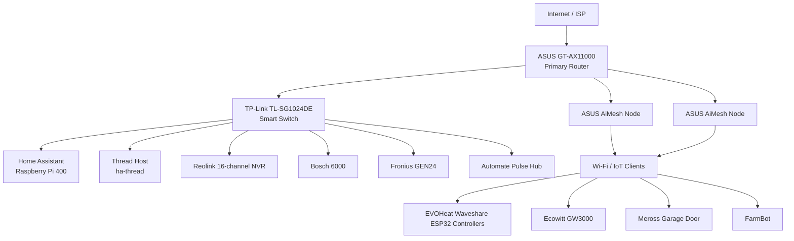

# Network Documentation

This section documents the network infrastructure that Home Assistant and the smart-home systems depend on.

The public repository focuses on **topology, device roles, protocols and troubleshooting methodology**. Credentials, authentication material, MAC addresses and unnecessary installation-specific identifiers are deliberately excluded.

## Current logical topology

## Primary router

**ASUS GT-AX11000**

Role:

- internet gateway;
- primary LAN router;
- Wi-Fi access point;
- AiMesh controller;
- DHCP and local network services.

### Known operational issue

The router has experienced recurring incidents where WAN connectivity is lost and a power cycle restores service. ASUS support diagnostics have therefore included collection and review of router syslogs.

Raw router logs must **not** be committed without review and sanitization.

## Ethernet switching

**TP-Link TL-SG1024DE**

Role:

- central Ethernet switching;
- management interface for switch configuration;
- connection point for important fixed infrastructure.

Future documentation should capture:

- physical port map;
- device connected to each relevant port;
- negotiated link speed;
- VLAN configuration, if introduced;
- management/recovery procedure.

A public port map should avoid exposing information that provides no reproducibility benefit.

## ASUS AiMesh

Two ASUS AiMesh nodes provide extended coverage to outbuilding areas including the garage and shed.

The exact node-to-location mapping still requires verification before being treated as authoritative documentation.

Future documentation should include:

- node model;
- physical location;
- wired or wireless backhaul;
- parent/uplink relationship;
- important IoT clients that depend on each node.

## Home Assistant host connectivity

The Home Assistant Raspberry Pi 400 has operated with both Ethernet and Wi-Fi interfaces.

For long-term documentation, the repository should distinguish:

- preferred production interface;
- fallback/recovery interface;
- hostname resolution;
- static/DHCP reservation strategy;
- backup access method when `homeassistant.local` is unavailable.

## Dedicated Thread host

A separate Raspberry Pi with hostname **`ha-thread`** is used for Thread infrastructure.

Known network characteristics:

- Ethernet interface used for LAN connectivity;
- `wpan0` Thread interface;
- Docker bridge present;
- separate from the main Home Assistant Pi 400.

The full Thread/OTBR network design will be documented under both:

- `docs/network/`
- `systems/thread-matter/`

## Important fixed infrastructure

The network includes the following important smart-home systems:

| System | Network role | HA relevance |
|---|---|---|
| Reolink 16-channel NVR | Fixed security/video infrastructure | CCTV integration and dashboard use |
| Bosch 6000 alarm | Fixed security infrastructure | HA integration details to verify |
| Fronius GEN24 inverter | Fixed solar/energy infrastructure | Monitoring and tested AC power-limit control |
| Sigenergy system | Energy/battery infrastructure | HA energy integration |
| Automate Pulse hub | Roller-blind infrastructure | Blind control / Thread-related system |
| Ecowitt GW3000 | Weather-station gateway | Local weather entities |
| EVOHeat Waveshare ESP32 controllers | Wi-Fi/MQTT edge controllers | Local hot-water monitoring |
| FarmBot | Garden automation | HA garden integration |
| Meross garage controller | Garage automation | HA cover entity |

## Addressing policy for this repository

The live installation uses private RFC1918 LAN addressing. Exact addresses can be extremely useful during maintenance, but they are not required for every public example.

The documentation policy is therefore:

1. document stable device names and roles first;
2. use placeholders in reusable configuration where possible;
3. publish private LAN addresses only when they materially clarify a reproducible setup;
4. never publish public WAN addresses, credentials, tokens or authentication data;
5. keep a separate private/local inventory if operational details are useful but unsuitable for GitHub.

## Network troubleshooting records

Known troubleshooting cases to migrate in sanitized form include:

- recurring ASUS WAN/IP-loss events;
- Home Assistant becoming unreachable by `homeassistant.local` after network changes;
- recovery by identifying the HA Pi through Ethernet/Wi-Fi interfaces;
- unavailable HA integrations while vendor apps remained functional;
- Thread and hub connectivity verification.

## Next network documentation tasks

1. Verify the physical router/switch/AiMesh topology.
2. Produce a public-safe switch port map.
3. Confirm which AiMesh node is garage versus shed.
4. Document the preferred HA Pi interface and recovery access procedure.
5. Document the full `ha-thread` / OTBR installation.
6. Inventory fixed network devices by role and protocol.
7. Add sanitized outage case studies under `docs/troubleshooting/`.
