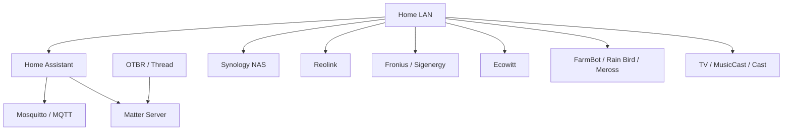

# Network Documentation

This section documents the network-facing architecture that can be confirmed from the live Home Assistant snapshot, while keeping private addressing, credentials and stable hardware identifiers out of the public repository.

## What the live Home Assistant snapshot confirms

The 9 September 2026 snapshot includes network-dependent integrations and infrastructure for:

- ASUS router monitoring through UPnP
- Home Assistant host / Raspberry Pi monitoring
- MQTT / Mosquitto
- Matter Server
- OpenThread Border Router
- Thread
- Synology DSM (2 config entries)
- Reolink NVR/cameras/doorbell
- Fronius solar equipment
- Sigenergy energy storage
- Ecowitt gateways
- FarmBot
- Rain Bird
- Meross LAN
- Automate Pulse Pro
- LG webOS TV
- Yamaha MusicCast
- Google Cast

The snapshot also contains Home Assistant apps for Samba share, Terminal & SSH, ESPHome Device Builder, Matter Server, Mosquitto broker and OpenThread Border Router.

## Logical network relationship



This is deliberately a **logical** diagram. The generated Home Assistant registry is not a reliable source for a complete physical Ethernet-switch or Wi-Fi-backhaul map.

## Addressing policy

The live installation uses normal private LAN addressing, but exact addresses are not published automatically.

Public documentation should prefer:

- device/system names
- protocol and role
- integration path
- port numbers only where they are required for reproduction
- placeholders for installation-specific addresses

Do not publish:

- WAN/public IP addresses
- MAC addresses
- Wi-Fi credentials
- MQTT credentials
- authentication tokens
- Thread operational datasets
- router administration credentials

Operational IP maps can be maintained privately outside this public repository.

## Home Assistant connectivity

The bulk-export workflow accesses the Home Assistant `config` share from the Mac through Samba and reads the live configuration without modifying the Home Assistant host.

The export command is:

```bash
zsh tools/ha-export/run-export.sh
```

The exporter then performs a public-safety pass before files are considered suitable for GitHub.

## MQTT

The live snapshot confirms both the MQTT integration and Mosquitto broker app.

MQTT currently provides a local integration path for DIY and ESP-based systems. Public configuration aliases stable hardware-derived IDs before commit.

## Thread and Matter

The live integration inventory includes:

- `thread`
- `otbr`
- `matter`

and the corresponding Home Assistant apps. This confirms the Home Assistant side of the Thread/Matter stack.

The repository intentionally excludes `thread.datasets` because Thread network credentials must never be published.

## Network services and storage

Two Synology DSM config entries are present in the live integration inventory. Public documentation can cover service roles and monitoring but should not publish storage hostnames, share credentials or internal management addresses unless specifically sanitised.

## Physical topology documentation

The exact physical router, switch-port and Wi-Fi/AiMesh topology should be documented separately from the generated HA inventory because Home Assistant cannot authoritatively determine all cabling and backhaul relationships.

A future physical-topology pass should record, in public-safe form:

1. router and switch models
2. fixed infrastructure roles
3. wired versus wireless uplinks
4. important service ports/protocols
5. recovery access paths
6. sanitized outage/troubleshooting cases

Private IP/MAC/port assignments that do not improve reproducibility should stay outside the public repository.

## Troubleshooting principle

Network fault documentation should preserve the **symptoms, diagnosis and recovery method** while removing account identifiers, public addresses, raw authentication material and unreviewed logs.
