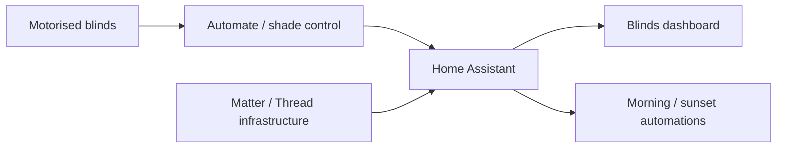

# Roller blinds

> **Status:** deployed. Seven roller-blind cover entities are represented in the live dashboard, with scheduled morning and sunset automations.

## Architecture

The live Home Assistant installation contains both `automate_pulse_pro` and Matter/Thread infrastructure. The dashboard also mixes normal cover entities with Automate battery telemetry. For that reason, this public documentation does **not** claim that every blind entity is sourced through one protocol/integration path. Use the live Home Assistant device/entity page when diagnosing an individual blind.

## Deployed covers

The public dashboard contains these friendly cover entities:

- Dining Room Back
- Dining Room Side
- Kitchen
- Living Room
- TV Room
- Primary Bedroom
- Dog Door

The dashboard offers per-blind open/close and position controls plus Open All, Stop All and Close All actions.

## Morning automation

The current automation opens all seven covers according to day type and daylight-saving offset:

- weekdays during daylight saving: 07:20
- weekdays during standard time: 07:30
- weekends: 08:00

The automation uses Home Assistant's UTC offset to distinguish the daylight-saving case.

## Sunset automation

At sunset the automation:

1. closes Dining Room Back;
2. closes Dining Room Side;
3. closes Kitchen;
4. closes Living Room;
5. closes Primary Bedroom;
6. closes TV Room;
7. sets the Dog Door blind to 68% rather than fully closing it.

The 68% position is installation-specific behaviour and should be reviewed if the opening, blind calibration or pet-access requirements change.

## Battery monitoring

The live dashboard includes battery cards for the blind devices. The Automate battery entities expose a battery percentage and a `battery_voltage` attribute used by the dashboard.

Hardware/device identifiers in these battery entities are installation-specific. Public documentation should use friendly cover names rather than publishing stable radio/device identifiers.

## Dashboard

The deployed dashboard is exported at:

- `home-assistant/live-export/dashboards/roller-blinds.yaml`
- `home-assistant/live-export/dashboards/roller-blinds.json`

It uses Home Assistant Sections/Tiles for normal cover controls and `custom:button-card` for the richer battery displays.

## Validation after changes

1. manually open and close each blind from Home Assistant;
2. confirm position reporting is sensible;
3. test Stop on a moving blind;
4. confirm Open All and Close All target the intended seven covers;
5. verify the Dog Door position can be set accurately;
6. check battery percentage/voltage values;
7. test the morning automation using Run actions or a temporary trigger;
8. test the sunset automation and verify the Dog Door remains at the intended partial position.

## Troubleshooting

### One blind is unavailable

Do not reset the whole system first. Open the affected cover's Home Assistant device/entity page and identify whether that entity is coming from Automate Pulse Pro, Matter, or another installed path before changing the hub or Thread network.

### All blinds are unavailable

Check the common control path(s), Home Assistant integrations and network connectivity before changing automations or dashboard YAML. If Matter-backed covers and Automate-only telemetry fail differently, use that split to narrow the fault.

### Cover position is wrong

Confirm the motor/hub/device calibration outside Home Assistant. A dashboard percentage is only as accurate as the blind's calibrated endpoints.

### Battery card is unavailable while cover control works

The battery sensor and cover entity can fail independently. Inspect the battery entity and its attributes rather than assuming the cover itself is offline.

### Morning automation runs at the wrong seasonal time

Check Home Assistant's configured timezone and UTC offset. The current automation distinguishes daylight saving from standard time using `now().utcoffset()`.

## Related documentation

- `systems/thread-matter/` — Home Assistant Thread/Matter stack
- `home-assistant/live-export/configuration/automations.yaml` — deployed morning/sunset logic
- `home-assistant/live-export/dashboards/roller-blinds.yaml` — deployed UI
