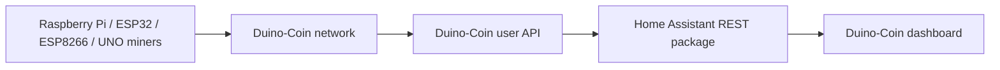

# Duino-Coin miner monitoring

> **Status:** deployed. Home Assistant polls the Duino-Coin account API and presents account/miner health through a dedicated dashboard.

## Architecture

The mining devices do not need to be individually integrated into Home Assistant for this dashboard. Home Assistant derives their status from the Duino-Coin API response.

## Source package

The deployed public-safe package is:

- `home-assistant/live-export/configuration/packages/duino_coin.yaml`

The REST resource is polled every 60 seconds with a 15-second timeout.

## Account-level sensors

The package provides:

- balance
- active worker count
- combined hashrate

## Miner groups

The live package monitors:

- Raspberry Pi miner(s)
- ESP32 miner(s)
- two ESP8266 miners
- eight Arduino UNO miners

It derives both hashrate sensors and connectivity/mining binary sensors from the API response.

The Raspberry Pi path also extracts CPU temperature when that information is present in the miner metadata.

## Dashboard

The deployed dashboard is:

- `home-assistant/live-export/dashboards/duino-coin-miner.yaml`
- `home-assistant/live-export/dashboards/duino-coin-miner.json`

It uses reusable `custom:button-card` templates to show miners as healthy, low-performing or offline.

For UNO miners the current dashboard visually warns when hashrate falls below 300 H/s. That is a presentation threshold, not a Duino-Coin protocol rule.

## Found-block monitoring

The package/automation set also includes Duino-Coin found-block monitoring so the dashboard can surface network/miner activity beyond only current hashrate.

## Validation

After modifying the package:

1. open the Duino-Coin user API in a safe test context and confirm it returns valid JSON;
2. reload/restart Home Assistant as required for REST configuration changes;
3. verify account balance and worker count populate;
4. compare active worker count with the Duino-Coin account view;
5. verify representative RPi, ESP and UNO hashrates;
6. stop one test miner and confirm its connectivity sensor eventually changes;
7. restart it and verify recovery;
8. open the dashboard on desktop/mobile.

## Troubleshooting

### Every Duino-Coin sensor is unavailable

Check the shared REST API path first:

1. internet connectivity;
2. API availability;
3. HTTP response/JSON format;
4. Home Assistant REST integration/logs.

Do not troubleshoot every miner independently if the shared API request is failing.

### Account totals work but one miner shows offline

Check the miner identifier used by the template against the identifier currently returned by the API. A renamed worker can appear offline even while it is mining successfully.

### Hashrate is zero but connectivity is on

The worker may be connected but not submitting useful work, or the API field/template may not match the miner type. Compare the raw account response before changing the dashboard.

### UNO shows a warning but is still mining

The dashboard currently uses a 300 H/s presentation threshold. Review actual expected performance for that miner before treating the orange/low state as failure.

### Raspberry Pi temperature is missing

Temperature is parsed from optional miner metadata. If the miner software stops sending that text, mining can remain healthy while the temperature sensor becomes unavailable.

### API changes break templates

The package depends on the structure of `value_json.result`. If Duino-Coin changes its API schema, update the REST templates together and validate account/miner sensors before touching dashboard styling.

## Public repository boundary

The public package necessarily identifies the public Duino-Coin account endpoint used by this installation, but it must never include exchange credentials, passwords, API secrets or unrelated private account data.
