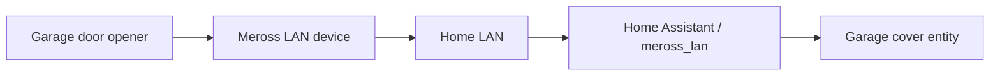

# Garage door

> **Status:** deployed through the `meross_lan` integration.

The garage-door opener is exposed to Home Assistant as a cover with associated status/problem telemetry. It is part of the wider Meross LAN installation but is documented separately because access control deserves a more conservative recovery/test procedure than an ordinary smart outlet.

## Architecture

## Home Assistant role

Home Assistant provides:

- door state
- open/close commands
- problem/availability telemetry where supported by the integration
- automation/dashboard access through the cover entity

There is no requirement for the whole-home repository to publish the device's internal address, hardware ID, Meross key or cloud credentials.

## Validation

After an integration/network change:

1. stand where the physical door can be observed safely;
2. verify Home Assistant reports the current open/closed state;
3. issue one open or close command;
4. confirm physical motion and final state;
5. verify the problem/availability entity is clear;
6. test from the Home Assistant client that will normally be used.

Do not repeatedly cycle the door just to test connectivity.

## Troubleshooting

### Cover becomes `unavailable`

Check in this order:

1. opener/controller power;
2. local LAN reachability;
3. `meross_lan` integration availability;
4. entity/device page in Home Assistant;
5. integration reload only after confirming the device is actually reachable.

If the vendor's own interface still controls the door while Home Assistant is unavailable, that is useful evidence that the physical opener is healthy and the fault is in the Home Assistant/local-integration path.

### Home Assistant says closed when the door is open

Treat state feedback as the problem, not the motor command. Inspect the opener's position/contact sensor and integration state before creating compensating automations.

### Command is sent but nothing moves

Check whether the cover state changes to opening/closing. If it does not, inspect the integration/device logs. If Home Assistant thinks it sent the command successfully but the opener remains idle, verify the device outside Home Assistant before further automation changes.

### Repeated flapping between available and unavailable

Look for LAN/Wi-Fi instability, IP reassignment or integration reconnect loops. Do not mask an unreliable access-control device with retries that could cause an unexpected door movement later.

## Safety

A garage door is a moving access-control device. Test only when the doorway is clear. Avoid unattended retry loops and do not expose public webhooks or unauthenticated commands for door operation.

## Related documentation

- `docs/network/README.md`
- `systems/network/README.md`
- `inventory/generated-live/integrations.md`
