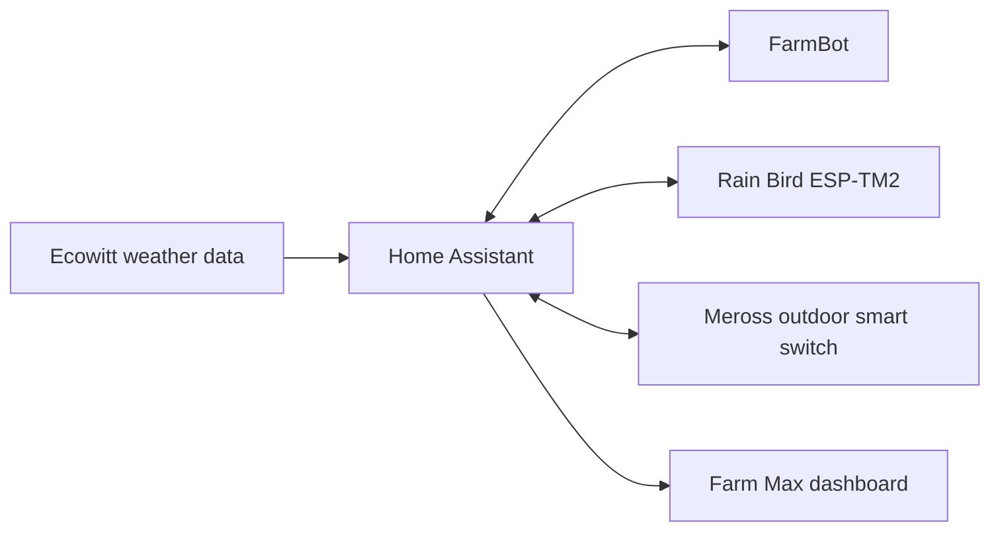

# Garden, irrigation and FarmBot

> **Status:** deployed. The live snapshot contains FarmBot, Rain Bird, Meross LAN and Ecowitt data used together by the Farm Max dashboard and garden automations.

## Architecture

The whole-home repository documents how these systems are orchestrated together. The FarmBot-specific Home Assistant integration remains maintained separately at:

- https://github.com/Darksplat/Homeassistant-Farmbot

## Power and pump switching

The live dashboard uses a two-outlet Meross smart switch as infrastructure for:

- pressure-pump power
- FarmBot power

Hardware-derived device identifiers are aliased in the public export, so public entity IDs such as `switch.smart_switch_deviceid_001_outlet_1` are placeholders for the installation-specific live IDs.

## Irrigation

The live Rain Bird integration represents an ESP-TM2 irrigation controller. The exported garden dashboard exposes sprinkler-zone switches and the automation currently coordinates pump power with selected irrigation zones.

### Current scheduled watering sequence

The exported automation runs on Monday and Thursday at 08:30 and performs this sequence:

1. turn on the pressure pump;
2. wait 15 seconds;
3. run sprinkler zone 1 for 30 minutes;
4. wait 10 seconds;
5. run sprinkler zone 3 for 30 minutes;
6. wait 10 seconds;
7. run sprinkler zone 2 for 30 minutes;
8. wait 10 seconds;
9. turn off the pressure pump.

The exact physical zone names should be treated as installation-specific. The dashboard currently presents the active garden zones by friendly name.

## FarmBot power schedule

The live automation turns FarmBot power on at 08:00 and off at 18:00 every day.

A separate automation at 17:55 performs a graceful shutdown by selecting the configured FarmBot shutdown sequence before the 18:00 power-off event.

This ordering is deliberate: software shutdown should finish before power is removed.

## Pressure-pump schedule

A separate Monday/Thursday pressure-pump schedule runs the pump from 13:30 to 13:35. This is independent of the morning irrigation sequence and should be reviewed if the hydraulic layout or pump purpose changes.

## Weather context

Farm Max reuses Ecowitt entities for:

- outdoor temperature
- humidity
- vapour pressure deficit
- solar radiation
- daily rain
- rolling 24-hour rain
- wind speed
- UV index

At present the exported irrigation automation is time based. The weather values are visible for operator context; do not assume rainfall automatically suppresses irrigation unless the automation is explicitly changed to do so.

## Dashboard

The deployed dashboard is:

- `home-assistant/live-export/dashboards/dashboard-garden.yaml`

It provides:

- FarmBot power status/control
- pressure-pump control
- irrigation-zone controls
- local growing/weather conditions
- operational overview

Confirmed frontend dependencies include Mushroom cards, `layout-card` and `card-mod`.

## Commissioning and validation

When changing the garden system:

1. verify the Meross switch outlets map to the intended loads;
2. manually test the pressure pump with irrigation valves closed/open as appropriate;
3. verify every Rain Bird zone individually;
4. confirm FarmBot can operate before enabling scheduled power cycling;
5. test the graceful-shutdown sequence manually;
6. confirm the shutdown completes before the 18:00 power-off automation;
7. run the irrigation sequence while observing pump state and actual water flow;
8. verify the dashboard weather data is current.

## Troubleshooting

### FarmBot power is on but Home Assistant reports FarmBot offline

Separate electrical power from application connectivity. Confirm the outlet state first, then check the FarmBot integration/MQTT/API status rather than repeatedly toggling power.

### Graceful shutdown automation reports an unknown action

The current implementation uses Home Assistant's standard `select.select_option` action against `select.farmbot_sequence`. Do not restore the obsolete `farmbot.execute_sequence` service if that service is not provided by the installed integration.

### Irrigation zone opens but no water flows

Check, in order:

1. pressure-pump outlet state;
2. pump operation;
3. Rain Bird controller availability;
4. correct zone switch;
5. valves/water supply.

### Pump runs after irrigation stops

The automation is sequential. Check the trace to determine which delay/action was reached. Use Home Assistant's automation trace before manually changing timings.

### Weather cards are unavailable

Troubleshoot the Ecowitt/weather subsystem separately. Garden control and weather display share data but are distinct integration paths.

## Safety

Automated irrigation can run unattended. Any change to pump switching should preserve a deterministic off action and should be tested with the physical water system observed. Do not rely only on a dashboard state to prove water has stopped.
