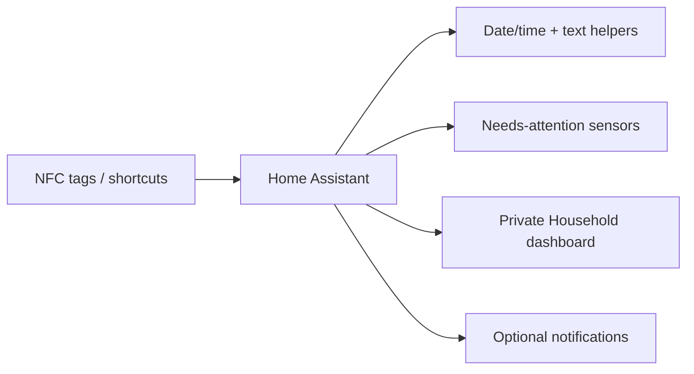

# Household chores and NFC workflows

> **Status:** deployed privately. The live package and Household dashboard are intentionally excluded from the public snapshot because they contain household-member-specific assignments and personal workflow detail.

This directory documents the **design pattern** without publishing the private live configuration.

## Architecture

## What the private system does

The deployed household workflow tracks recurring care/tasks such as:

- pet feeding
- pet walking
- water-bowl cleaning
- bathing/grooming care
- recurring tablet/medication-style pet-care tasks
- who completed a task
- when it was last completed
- whether a task currently needs attention

NFC tags and mobile shortcuts are used to make completion quick from a phone rather than requiring a dashboard form every time.

## Design pattern

A typical chore uses:

1. an `input_datetime` helper storing the last completion time;
2. an `input_text` helper storing who completed it;
3. a template binary sensor representing whether attention is required;
4. an automation/script that updates the helpers;
5. a dashboard card showing current state and completion information.

This separates **history/state** from **presentation**, which makes the dashboard replaceable without losing the underlying chore logic.

## NFC workflow

A safe NFC design is:

1. scan a tag;
2. Home Assistant identifies the task/category;
3. optionally ask the user to choose a specific action/person;
4. write completion timestamp and actor to helpers;
5. refresh the template status;
6. provide lightweight feedback to the phone/watch if useful.

Tag IDs should be treated as installation-specific identifiers and are not required in the public repository.

## Dashboard status model

The private implementation uses attention-oriented status rather than simply showing raw timestamps. For example:

- attention required -> prominent warning state
- completed/current -> normal/green state
- not yet due -> neutral state

The exact schedule rules belong to the private household configuration because they can reveal routines.

## Public repository boundary

The export safety pass removes:

- the live household chores package;
- the live Household dashboard;
- detailed Companion App registry rows.

Public documentation should not contain:

- household-member names/assignments;
- NFC tag UIDs;
- personal schedules beyond generic examples;
- private notification targets;
- sensitive care/health information.

## Building a similar system

For a generic installation:

1. create one last-completed helper per task;
2. optionally create a completed-by helper;
3. define the due/attention rule as a template binary sensor;
4. create a script that records completion;
5. test the script manually;
6. connect NFC/tag triggers only after the script works;
7. build the dashboard last.

## Troubleshooting

### NFC scan opens Home Assistant but does not update the chore

Check the tag/shortcut trigger and automation trace first. Confirm the completion script works when called manually.

### Chore stays red after completion

Inspect the helper values and the template sensor. A dashboard card normally reflects the template; changing card colours will not fix stale helper data.

### Wrong person is recorded

Keep actor selection separate from task identification. Avoid hard-coding a person into a shared tag unless that tag is genuinely personal.

### Phone works but Assistive Access / simplified mode does not

Treat the mobile OS shortcut/permissions layer separately from Home Assistant. Confirm the same tag/action works in the normal Home Assistant app before changing the Home Assistant automation.

## Repository policy

This subsystem is deliberately the exception to the normal live-export pattern: architecture is public, household-specific implementation remains private.
