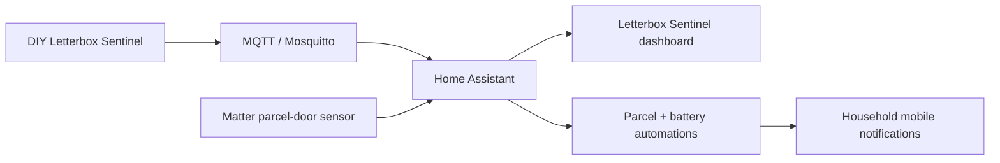

# Letterbox Sentinel

> **Status:** deployed DIY mail/parcel monitoring subsystem using MQTT plus a separate Matter door/window sensor for parcel events.

## Architecture

The main Sentinel and the parcel-door sensor are separate devices. Keeping their event paths distinct makes it easier to identify whether a fault is MQTT/DIY hardware or Matter/Thread related.

## Mail state and counters

The live dashboard includes:

- mail-waiting binary state
- letter counter
- last mail detected time
- last collection time
- collected-by state

The dashboard deliberately distinguishes three states:

- mail waiting
- no mail
- Sentinel sleeping/offline

The sleeping state is expected behaviour for a battery-conscious device and should not automatically be treated as a fault.

## Environmental and power telemetry

The dashboard also presents:

- temperature
- humidity
- sea-level pressure
- battery percentage
- battery voltage
- low-battery binary state
- Wi-Fi signal

This telemetry is useful for separating sensor logic problems from power/network problems.

## Controls

The live dashboard exposes controls to:

- clear mail waiting
- reset the letter counter
- test mail detection

Use test controls before opening the enclosure or altering automations when investigating detection problems.

## Parcel detection

A separate Matter door/window sensor is used for parcel-door events. The deployed automation latches a Home Assistant parcel-waiting helper and sends a mobile notification when the parcel door opens.

Direct Companion App target names are anonymised in the public export.

## Battery alerts

The live automations implement two-stage battery warnings for both the parcel sensor and the main Sentinel battery:

- warning when the value drops below 26%;
- critical warning when it drops below 16%.

Critical notifications are configured as time-sensitive where appropriate.

## Dashboard

The public-safe deployed dashboard is:

- `home-assistant/live-export/dashboards/letterbox-sentinel.yaml`

It contains two views and uses Home Assistant Sections plus `custom:apexcharts-card` for battery visualisation.

## Validation

1. wake/confirm the Sentinel is online;
2. use the dashboard test-mail control;
3. verify mail-waiting changes;
4. clear mail waiting from Home Assistant;
5. confirm counter/last-detected fields update;
6. open the parcel door and verify the Matter sensor changes state;
7. confirm parcel-waiting latches and a notification is delivered;
8. inspect battery, voltage and Wi-Fi telemetry.

## Troubleshooting

### Dashboard says Sentinel sleeping/offline

First determine whether the device is intentionally asleep. Check last-update timestamps and normal wake behaviour before treating this as an outage.

### Mail beam/test works but mail-waiting does not latch

Inspect the MQTT binary sensor and Sentinel logic separately. Use the test-mail button to reproduce the event under controlled conditions.

### Parcel sensor works but no notification arrives

Check the parcel automation trace and notification subsystem. If the Matter door entity changes correctly, the radio/device side is already proven.

### Parcel sensor is unavailable

Troubleshoot the Matter/Thread subsystem, battery and device commissioning rather than the MQTT Sentinel.

### Battery percentage looks wrong

Compare percentage with raw battery voltage. Battery-percentage conversion can be approximate; voltage trend is often more useful for diagnosing an aging or discharged cell.

### Wi-Fi is weak

The mailbox location can be challenging for 2.4 GHz coverage. Investigate signal and power before increasing retry rates or shortening sleep intervals, both of which can reduce battery life.

## Public repository boundary

Do not publish:

- Wi-Fi/MQTT credentials
- raw device hardware IDs
- personal notification target names
- NFC/tag/user identifiers related to mail collection

The live dashboard and automations are sanitized by the repository export pipeline before publication.
