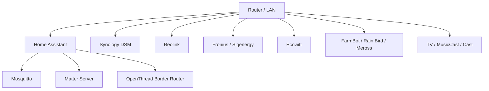

# Network subsystem

> **Status:** deployed. This page is the subsystem/operator view of networking; `docs/network/README.md` contains the wider public-safe architectural policy.

Home Assistant depends on the LAN for most of the installation: cameras, solar/battery equipment, weather gateways, FarmBot, Rain Bird, Meross devices, NAS monitoring, media devices, MQTT, Matter and Thread border routing.

## Home Assistant-facing architecture

The live integration inventory confirms UPnP router monitoring, two Synology DSM entries, MQTT, Matter, OTBR/Thread, Reolink, Fronius, Sigenergy, Ecowitt, FarmBot, Rain Bird, Meross LAN, Automate Pulse Pro and multiple media integrations.

## Addressing policy

The public repository does not need a full private-IP map to be useful. Public documentation should prefer:

- system role
- protocol
- integration name
- required service port only when needed for reproduction
- friendly device names

Keep private:

- WAN/public IP addresses
- MAC addresses
- Wi-Fi passwords
- router administration credentials
- MQTT credentials
- Thread operational datasets
- unreviewed network captures

## Core network-dependent services

### MQTT

Mosquitto and the Home Assistant MQTT integration are central to local DIY systems including the current EVO270 and Letterbox Sentinel paths.

### Matter / Thread

Matter Server and OTBR are network services, not just radio components. IPv6 and local multicast/discovery health matter to commissioning and device stability.

### Samba export path

The repository's bulk-export workflow reads the Home Assistant `config` share over Samba from the Mac. This is an administrative/documentation path and not a dependency for normal automations.

### Synology monitoring

The live Home Assistant inventory contains two Synology DSM integration entries. The public repository documents monitoring roles but not NAS credentials or private management addresses.

## Fault isolation workflow

When many unrelated integrations fail together, troubleshoot the network before individual devices.

Recommended order:

1. confirm Home Assistant itself is responsive locally;
2. check host network connectivity;
3. confirm router/LAN health;
4. test reachability to one known local device from each affected segment/type;
5. inspect UPnP/WAN status only if internet-dependent integrations are also failing;
6. distinguish DNS/name-resolution faults from raw IP connectivity;
7. inspect integration-specific logs only after the common network layer is healthy.

## Local versus internet faults

A useful split is:

- **local LAN integrations fail, internet still works:** suspect LAN switching/Wi-Fi/routing or Home Assistant host connectivity;
- **local integrations work, cloud/forecast services fail:** suspect WAN/DNS/provider side;
- **both fail:** start at router/WAN/Home Assistant host path;
- **one device fails:** isolate that device before changing global network settings.

## Home Assistant hostname access

`homeassistant.local` depends on local name discovery. Failure of the `.local` name does not prove Home Assistant is offline. Test the host by its known private address from the local administration environment before rebooting hardware.

## Troubleshooting recurring outages

Preserve evidence before power cycling where possible:

1. note exact failure time;
2. save router/system logs;
3. identify whether WAN, LAN or both were affected;
4. record which Home Assistant integrations became unavailable;
5. then perform the minimum recovery action required.

Power cycling can restore service while also destroying the evidence needed to find the cause.

## Relationship to system monitoring

`systems/system-monitoring/` covers the Home Assistant entities used to observe host/apps/integration health. This network page focuses on communication dependencies and fault isolation.

## Related documentation

- `docs/network/README.md`
- `systems/thread-matter/README.md`
- `systems/system-monitoring/README.md`
- `docs/troubleshooting/README.md`
