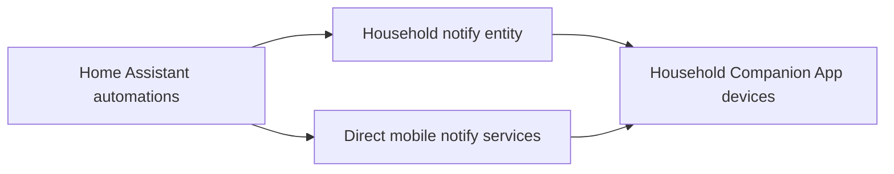

# Notifications

> **Status:** deployed. Mobile Companion App details are intentionally anonymised in the public export.

Notifications are a shared service used by multiple subsystems rather than a single dashboard. Current public-safe examples include bin-night reminders and Letterbox Sentinel alerts.

## Architecture



## Public-safe handling

The source installation contains multiple Home Assistant Companion App registrations. The public exporter deliberately:

- removes detailed mobile-app registry rows;
- aliases `notify.mobile_app_*` service names;
- does not publish personal device names;
- does not publish notification tokens or app credentials.

This lets automation logic remain understandable without exposing household device identities.

## Household notification group

The bin-night automation uses a notify entity named:

```text
notify.household_notifications
```

with Home Assistant's modern notify-entity action:

```yaml
action: notify.send_message
target:
  entity_id: notify.household_notifications
```

This is the preferred pattern for a reusable household-wide destination.

## Direct notifications

Some operational alerts, such as Letterbox Sentinel parcel/battery warnings, are sent to direct Companion App targets in the live installation. In the public export those targets become generic names such as:

```text
notify.mobile_app_household_device_01
```

These aliases are documentation placeholders and are not intended to be pasted back into a different Home Assistant installation unchanged.

## Current notification use cases

- bin-night reminder when one or more waste streams are due the following day;
- parcel-delivered notification;
- Letterbox Sentinel battery warnings;
- urgent/critical battery warning variants using time-sensitive interruption behaviour where configured.

## Adding a new notification workflow

1. decide whether the alert is household-wide or device-specific;
2. prefer a reusable notify group for household-wide messages;
3. include a concise title and actionable message;
4. avoid repeated alerts for the same state unless escalation is deliberate;
5. use time-sensitive interruption only for genuinely urgent conditions;
6. test the notify action manually before enabling the automation trigger;
7. confirm notification permissions on recipient devices.

## Troubleshooting

### `unknown action: notify.some_group`

A notify entity is not automatically a callable action name. Use `notify.send_message` and target the entity unless the integration explicitly documents a service-style notify action.

### Automation runs but no phone receives it

Check:

1. automation trace;
2. target notify entity availability;
3. Companion App registration;
4. OS notification permissions;
5. focus/do-not-disturb settings;
6. whether the device has recently re-registered under a different notify service.

### One recipient stops receiving group notifications

Test the direct notify service for that device first. If direct delivery fails, fix the Companion App registration before changing the group.

### Duplicate notifications

Check whether both a group target and direct target are being used in the same automation, or whether multiple automations respond to the same event.

## Privacy rule

Never publish:

- push tokens
- raw Companion App registration data
- personal device names when unnecessary
- location/presence data
- private webhook identifiers

The public repository should document the notification architecture, not the identities of recipients.
