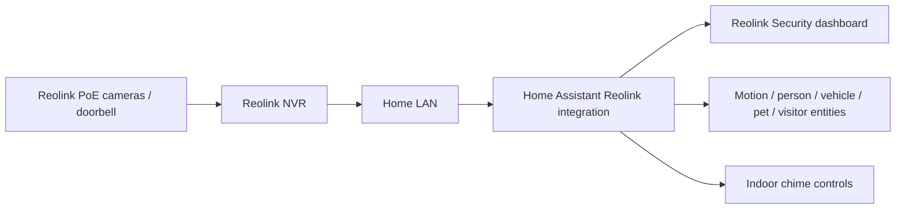

# Security and Reolink CCTV

> **Status:** deployed. The live snapshot confirms a Reolink NVR/camera/doorbell installation with nine camera views and two indoor chimes presented through Home Assistant.

## Architecture

The public repository does not store camera passwords, NVR credentials, RTSP URLs, ONVIF credentials or private network addressing.

## Live dashboard

The deployed dashboard is exported at:

- `home-assistant/live-export/dashboards/dashboard-reolink.yaml`
- `home-assistant/live-export/dashboards/dashboard-reolink.json`

The dashboard reports:

- nine camera views
- six front-zone views
- three rear-zone views
- two indoor chimes

It is organised as a Home Assistant Sections dashboard and includes live/auto camera cards for the doorbell, front door, overall front/rear views, gates, front garden, backyard and other deployed cameras.

## Event entities

The Reolink integration exposes event-oriented binary sensors such as:

- motion
- person
- vehicle
- pet/animal
- doorbell visitor

Not every camera supports every event class. Dashboard/automation logic should use only the entities actually provided by that camera model/channel.

## Chimes

The live dashboard includes controls for two Reolink chimes and currently exposes their LED switches as quick status/control badges.

## Frontend dependencies

Confirmed by the live dashboard:

- Home Assistant picture-entity cards
- Mushroom template cards
- Sections layout
- `card-mod`

The Home Assistant integration inventory also includes `go2rtc`, which is part of the wider camera/streaming environment. Stream behaviour should still be validated from the actual Home Assistant camera entities rather than assuming a particular transport path.

## Validation

After changing the Reolink integration or network:

1. verify the NVR/integration is available;
2. open every camera entity individually;
3. confirm the doorbell live view;
4. verify at least one motion/person event on representative cameras;
5. confirm the doorbell visitor entity changes when the button is pressed;
6. test both chime controls;
7. open the full Reolink dashboard on desktop and mobile;
8. check for stale/unavailable camera entities.

## Troubleshooting

### Every Reolink camera is unavailable

Treat this as an NVR/network/integration fault first. Check NVR power/connectivity and the Home Assistant Reolink integration before investigating nine cameras individually.

### One camera is unavailable

If the NVR and other cameras are healthy, isolate the affected channel/camera/PoE path. Do not reload or rebuild the whole integration as the first step.

### Camera entity exists but live video does not start

Separate entity availability from stream delivery. Check:

1. whether snapshots update;
2. whether the camera itself is reachable through the NVR/vendor interface;
3. Home Assistant/go2rtc stream handling;
4. browser/client-specific playback;
5. network bandwidth or connection exhaustion.

### Detection sensors stopped updating

Confirm the detection feature is enabled on the camera/NVR channel and supported by that model. A working video stream does not guarantee every smart-detection entity is enabled.

### Doorbell video works but visitor events do not

Troubleshoot the doorbell event entity separately from video. Verify the button press is visible in the Reolink integration/device page before changing dashboard cards.

### Dashboard loads slowly

Nine concurrent camera views can be heavy on browsers and mobile clients. Use `camera_view: auto` where full live streaming is not required and reserve live view for priority cameras.

## Security boundary

Camera credentials and stream URLs are high-value secrets. They must remain in Home Assistant/integration storage or `secrets.yaml`-style private configuration and must never be copied into public troubleshooting examples.

## Related subsystem

The DIY mail/parcel system is documented separately under `systems/letterbox-sentinel/` because it uses MQTT/Matter sensors rather than the Reolink CCTV path.
