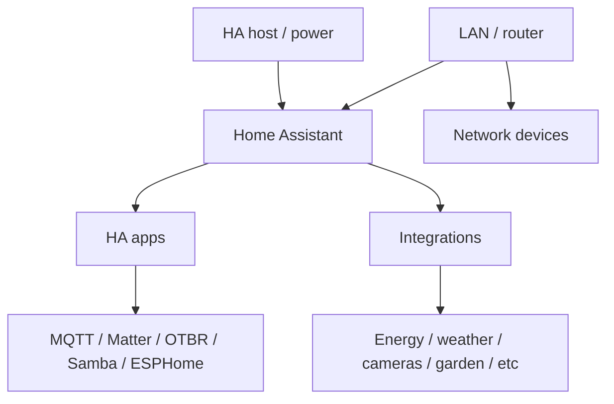

# System monitoring

> **Status:** deployed. Home Assistant exposes host, app, integration and network-service health used for fault isolation across the smart-home installation.

## Scope

This subsystem is not one product. It is the operational layer that answers questions such as:

- is Home Assistant itself healthy?
- is the host powered correctly?
- are core apps running?
- is the network path alive?
- which integration failed first?
- is an outage local to one subsystem or common across many?

## Live monitoring sources

The sanitized snapshot confirms monitoring/health data from:

- Home Assistant Core / Supervisor / OS
- Raspberry Pi / `rpi_power`
- Home Assistant app state through `hassio`
- UPnP/router status
- two Synology DSM integrations
- MQTT/Mosquitto
- Matter Server
- OpenThread Border Router
- ESPHome Device Builder
- Samba share
- custom integrations and their entities

The detailed generated entity registry is intentionally not published, so this documentation focuses on classes of health signal rather than a permanent list of every entity ID.

## Monitoring model

## Health hierarchy

When diagnosing an outage, check from broadest dependency to narrowest:

1. **Host:** is the Home Assistant machine powered and reachable?
2. **Core:** is Home Assistant responding?
3. **Network:** can Home Assistant reach local infrastructure?
4. **Apps/services:** MQTT, Matter Server, OTBR, etc.
5. **Integration:** is the relevant integration loaded/connected?
6. **Device:** is the specific device available?
7. **Entity/dashboard:** is only one entity/card stale?

This avoids wasting time debugging a leaf entity when the actual problem is an upstream service.

## Home Assistant app health

The live installation includes apps such as:

- Mosquitto broker
- Matter Server
- OpenThread Border Router
- ESPHome Device Builder
- Samba share
- Terminal & SSH
- Studio Code Server / editor tooling

Not every app is required for every subsystem. A stopped Studio Code Server should not be treated as a home-automation outage; a stopped Mosquitto broker can affect MQTT-backed production systems.

## Network/storage health

UPnP and Synology DSM provide useful infrastructure context. Their availability can help distinguish:

- Home Assistant-only faults
- broader LAN faults
- NAS-specific problems
- WAN/router problems

## Dashboard strategy

The Home Operations dashboard is the high-level operational summary. Specialist dashboards then provide subsystem detail:

- Energy Max
- Weather Operations Centre
- Farm Max
- Reolink Security
- Hot Water
- Roller Blinds
- Letterbox Sentinel
- Duino-Coin

A good monitoring dashboard should surface exceptions and current state, not reproduce every raw sensor.

## Troubleshooting method

### Many unrelated entities become unavailable at once

Look for a shared dependency: Home Assistant host, LAN, router, DNS, MQTT, Matter Server, or another common service.

### One integration fails after a Home Assistant restart

Check integration logs and startup order. Avoid deleting/re-adding the integration until configuration and connectivity have been verified.

### App shows stopped

Determine whether it is operationally critical before restarting it. If critical, capture recent logs first when practical, then restart only the affected app.

### Host power warning

Treat Raspberry Pi power/undervoltage warnings as infrastructure faults. Software troubleshooting is unreliable if the host is not electrically stable.

### Monitoring itself is unavailable

Use an out-of-band path: router UI, direct device interface, vendor app, SSH/console, or local network tests. Monitoring cannot prove its own health when Home Assistant is down.

## Evidence collection

For recurring faults, record:

- timestamp
- affected systems
- Home Assistant log excerpt
- relevant app/integration state
- router/system log if network-related
- recovery action
- whether the fault recurred

Sanitize credentials, public addresses and stable identifiers before committing diagnostics.

## Related documentation

- `systems/network/README.md`
- `docs/network/README.md`
- `docs/troubleshooting/README.md`
