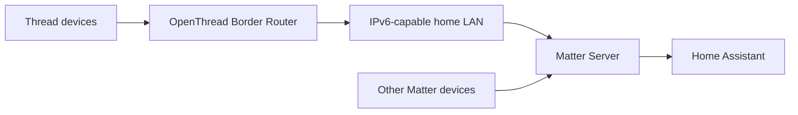

# Thread and Matter

> **Status:** deployed Home Assistant Thread/Matter stack. The sanitized live snapshot confirms `thread`, `otbr` and `matter` integrations together with the Matter Server and OpenThread Border Router Home Assistant apps.

## Architecture

Thread is the IPv6 mesh transport for supported devices. Matter is the application/control protocol. They are related but not interchangeable, so troubleshooting should identify whether a problem is at the radio/Thread layer, border-router layer, Matter Server layer, or device/application layer.

## Live Home Assistant components

The public integration inventory confirms:

- `thread`
- `otbr`
- `matter`
- Matter Server app
- OpenThread Border Router app

The live system also contains commissioned Matter devices including IKEA plugs/buttons/door sensors/air-quality equipment and shade-related devices.

## Blinds relationship

The roller blinds are documented separately under `systems/blinds/`. The live system also contains an `automate_pulse_pro` integration. Do not assume every blind entity is directly controlled through Matter simply because Matter/Thread infrastructure exists on the same Home Assistant installation.

## Commissioning workflow

A safe commissioning sequence is:

1. verify Home Assistant is healthy;
2. verify Matter Server is running;
3. verify the Thread/OTBR integration is available if the device is Thread based;
4. confirm the phone used for commissioning is on the intended LAN and can reach Home Assistant;
5. place the device in commissioning mode;
6. add it through Home Assistant's Matter flow;
7. wait for the device/entities to finish populating;
8. assign a friendly name and area;
9. test the device from Home Assistant;
10. only then add it to automations/dashboards.

## Thread credentials and datasets

Thread operational datasets contain network credentials. The public exporter deliberately excludes `.storage/thread.datasets`.

Never commit:

- Thread network keys
- operational datasets
- Matter fabric credentials
- pairing/setup codes when they are still security-sensitive
- private certificates or commissioning secrets

The public repository should describe topology and behaviour, not publish fabric secrets.

## Troubleshooting

### Matter Server unavailable

Check the Matter Server app first. If it is not running, individual device troubleshooting is premature.

### Thread device is commissioned but goes offline

Check the stack from the bottom up:

1. device power/battery;
2. Thread radio reachability/mesh;
3. border router availability;
4. IPv6/multicast connectivity on the LAN;
5. Matter Server;
6. Home Assistant entity state.

### Wi-Fi Matter devices work but Thread Matter devices fail

That strongly points toward Thread/OTBR/IPv6 rather than Matter Server alone.

### Thread devices work but one Matter accessory fails

Treat it as a device/fabric/commissioning issue before changing the entire Thread network.

### Device was factory-reset

A factory reset can invalidate the fabric relationship. Remove/recommission only the affected device when possible rather than rebuilding the whole Matter/Thread environment.

### Discovery or commissioning stalls

Matter commissioning depends heavily on local multicast/IPv6 reachability. Check VLAN, Wi-Fi isolation, firewall and multicast behaviour before repeatedly resetting the accessory.

## Recovery principle

Avoid destructive recovery steps early. A stable Thread fabric may contain many working devices, so resetting the border router/fabric to fix one accessory can turn a single-device fault into a whole-house outage.

## Related documentation

- `docs/network/README.md` — logical LAN architecture and privacy policy
- `systems/blinds/README.md` — roller-blind control
- `inventory/generated-live/integrations.md` — public-safe integration counts
