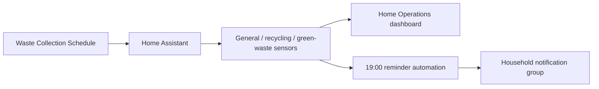

# Waste collection and bin-night reminders

> **Status:** deployed. The live snapshot confirms the Waste Collection Schedule integration and an active 19:00 bin-night reminder automation.

## Architecture



## Due-date sensors

The deployed Home Assistant configuration uses three day-count sensors:

- `sensor.waste_collection_schedule_general_waste`
- `sensor.waste_collection_schedule_recycling`
- `sensor.waste_collection_schedule_green_waste`

The dashboard interprets the numeric state as days until collection:

- `0` = today
- `1` = tomorrow
- larger values = number of days remaining

## Bin-night automation

At 19:00 every day, the automation checks whether any of the three sensors equals `1`.

If at least one collection is due tomorrow, it builds a dynamic list of the required bins and sends a single household notification.

The current action uses Home Assistant's modern notify-entity syntax:

```yaml
action: notify.send_message
target:
  entity_id: notify.household_notifications
```

This is intentional. A group notify entity should not be substituted directly as an action name unless Home Assistant explicitly provides it as a service.

## Dashboard

The Home Operations dashboard contains three prominent bin cards. They change presentation according to how close the collection is, making today/tomorrow collections visually obvious.

Relevant file:

- `home-assistant/live-export/dashboards/home-operations.yaml`

## Validation

1. open Developer Tools -> States;
2. confirm all three waste sensors contain numeric day counts;
3. use the automation's Run actions/test path with a temporary template if needed;
4. confirm `notify.household_notifications` exists as a notify entity;
5. send a manual `notify.send_message` test;
6. verify the dashboard card wording matches the sensor state.

## Troubleshooting

### Reminder automation reports an unknown action

Use `notify.send_message` and target the notify entity. The deployed configuration already follows this syntax.

### No notification was sent

Check:

1. whether any sensor actually equals `1` at 19:00;
2. automation trace/conditions;
3. `notify.household_notifications` availability;
4. notification permissions on the recipient devices.

### Wrong bin is listed

Inspect the three source sensor states first. The automation only reports what the Waste Collection Schedule integration provides.

### Sensors are `unavailable`

Troubleshoot the Waste Collection Schedule integration/provider configuration rather than the notification action.

### Collection date changed unexpectedly

Check upstream council/provider data and integration refresh timing before hard-coding a date override. The value of this subsystem is that schedules remain data-driven.

## Privacy

The public repository documents the notification group name but does not publish individual household Companion App device identities. Direct mobile notification services are anonymised by the export safety pass.
