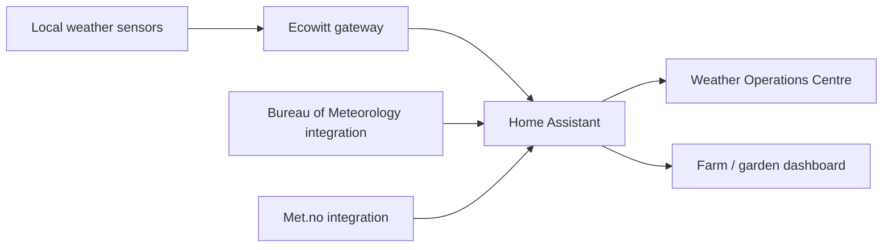

# Weather and environmental monitoring

> **Status:** deployed and represented by the sanitized 9 September 2026 live Home Assistant snapshot.

This subsystem combines a local Ecowitt weather station with Australian Bureau of Meteorology forecast/warning data. The intent is to keep locally measured conditions separate from forecast data while presenting both together in Home Assistant.

## Architecture

The live integration inventory contains three `ecowitt` entries, `bureau_of_meteorology`, and `met`. The local station is represented through GW3000-series gateway evidence.

## Local measurements

The live dashboard consumes Ecowitt entities for, among other things:

- outdoor and indoor temperature
- feels-like temperature
- humidity and dew point
- relative pressure
- wind speed, gust and direction
- UV index
- solar radiation
- daily and rolling 24-hour piezo rainfall
- vapour pressure deficit

These local sensors are the preferred source for actual conditions at the property.

## BOM forecast and warning data

The responsive dashboard uses Bureau of Meteorology entities for:

- daily forecast
- hourly forecast
- warnings
- wind speed
- wind direction
- precipitation probability and forecast context

The design deliberately allows local observation data and BOM forecast data to be compared rather than treating one provider as a replacement for the other.

## Dashboard

The deployed dashboard is exported at:

- `home-assistant/live-export/dashboards/pioneer-drive-weather-operations-centre-max.yaml`
- `home-assistant/live-export/dashboards/pioneer-drive-weather-operations-centre-max.json`

The live export reports six views covering:

1. Overview
2. Rain
3. Wind
4. Climate
5. Sun & Solar
6. Station

The overview includes a daily forecast, a separate next-12-hours BOM forecast, BOM warning/wind tiles, and local Ecowitt instruments.

The dashboard is deliberately responsive and is the primary full weather interface. The Home Operations and Farm Max dashboards reuse a smaller subset of the same weather entities.

## Frontend dependencies

The live YAML confirms use of:

- Home Assistant built-in cards/layouts
- `custom:weather-forecast-card`
- `card-mod`

Additional installed weather-oriented frontend components are present in the live HACS/device inventory; use the exported YAML as the authoritative dependency list when rebuilding the dashboard.

## Validation

After commissioning or changing the weather stack:

1. confirm the Ecowitt gateway is updating Home Assistant;
2. verify outdoor temperature changes plausibly;
3. compare local wind/rain values with the gateway/application if available;
4. verify both BOM daily and hourly weather entities are available;
5. check the warning entity;
6. open each dashboard view and check for unavailable entities;
7. verify the Farm Max and Home Operations weather cards also update.

## Troubleshooting

### Local Ecowitt values are unavailable

Check the Ecowitt integration/gateway first. If every local sensor fails at once, treat it as a gateway/network/integration problem rather than a failed individual sensor.

Useful sequence:

1. verify the gateway is powered and on the LAN;
2. check the Ecowitt integration status;
3. reload the integration if appropriate;
4. confirm the entity `last_updated` times advance;
5. only then investigate individual sensor batteries or radio links.

### BOM weather is unavailable but Ecowitt still works

This normally isolates the fault to the forecast/internet/provider side rather than the local station. Check the Bureau of Meteorology integration separately and avoid disturbing the working Ecowitt path.

### Dashboard shows old/unavailable entities

The dashboard has been revised as entity names changed. Compare the affected card with Developer Tools -> States and update the card to the currently available entity rather than creating duplicate helpers to preserve an obsolete name.

### Rain values look inconsistent

Confirm whether the card is showing daily rain, rolling 24-hour rain, or another accumulation period. These are intentionally separate measurements.

## Public repository boundary

The repository documents entity roles and dashboard behaviour but does not publish gateway credentials, private addressing, stable radio identifiers, or unreviewed diagnostic dumps.
